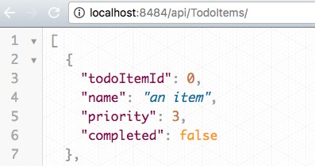

# VSTDA API
> Using mock data and contract, implements an API server using ExpressJS.

This was my eight project at Origin Code Academy. This API server was created using Node, Express, Lodash, and body-parser.



## Background

A RESTful API is an application program interface (API) that uses HTTP requests to GET, PUT, POST and DELETE data. A RESTful API is based on representational state transfer [(REST)](https://stackoverflow.com/questions/671118/what-exactly-is-restful-programming) technology.

## Approach

I implemented GET, POST, and DELETE per the specification. I used the JavaScript utility library, Lodash, to work with arrays. Body-parser is an application that was used to handle HTTP Post requests. Additionally, I used Postman to verify my code was working as expected.

## Installation

Download all associated files and load them up in your favorite text editor!

## Development setup

This app relies on Node, Express, [Lodash](https://lodash.com/), and [body-parser](https://github.com/expressjs/body-parser), for its functionality.

I recommend using [nodemon](https://www.npmjs.com/package/nodemon) to run this server.

```sh
npm install -g nodemon
// cd to-your-web-folder
nodemon server
```

## Contact Information

Twitter: [@adriftinthesea](https://twitter.com/adriftinthesea)

Email: z@zamarise.com

GitHub: [https://github.com/zamarise](https://github.com/zamarise/)
